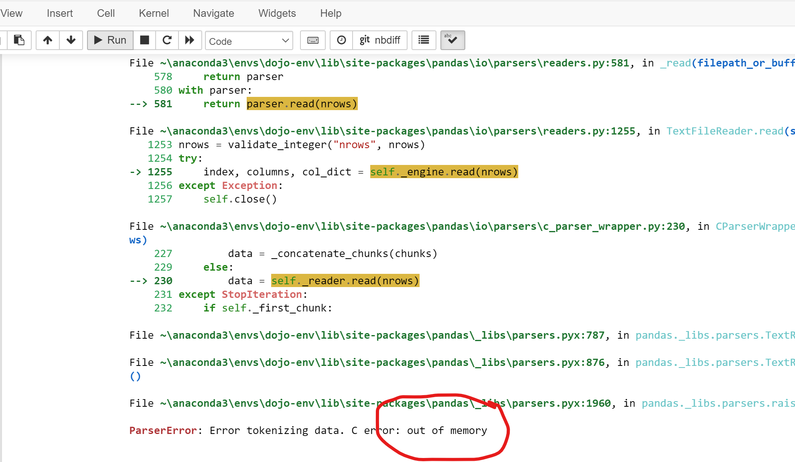

# Processing Large Files with Low RAM

## Problem
- Your machine runs out of RAM (memory) when loading in a large file.



## Solution

Instead of loading the entire dataframe using pd.read_csv, we can instead create a special TextFileReader object, which will allow us to read in our dataframe in chunks. 


1. Use the chunksize argument for `pd.read_csv` to create a TextFileReader.
    - chunksize is the number of rows to load at once. 
    - We will use 100,000 rows in our examples.

```python
df_reader = pd.read_csv(basics_url, sep='\t', low_memory=False, chunksize=100_000 )
df_reader
```
`<pandas.io.parsers.readers.TextFileReader at 0x2ed437f40>`

2. Use the .get_chunk() method to extract the first chunk of rows. 

```python
temp_df = df_reader.get_chunk()
```
3. Figure out your entire workflow for that file using just temp_df chunk, and save to disk.

4. Now combine the workflow into 1 large loop through the entire textfilereader.

5. Use glob to easily combine all chunk csvs into 1 final.


```python
import numpy as np
import pandas as pd
import matplotlib.pyplot as plt
import seaborn as sns
import os
os.makedirs('Data',exist_ok=True)
```


```python
## title basics 
basics_url = 'https://datasets.imdbws.com/title.basics.tsv.gz'
df_reader = pd.read_csv(basics_url, sep='\t',
                        low_memory=False, chunksize=100_000)
df_reader
```


    <pandas.io.parsers.readers.TextFileReader at 0x106670e80>


- We now get a TextFileReader instead of a DataFrame. 
- The TextFileReader is designed to return one chunk at a time from the source file as a dataframe using the `reader.get_chunk()` method. 
    - It keep tracks of its position in the original file using the  `._currow` attribute. 


```python
## the first row # of the next chunk is stored under ._currow
df_reader._currow
```


    0


- We haven't loaded any chunks yet so currow should indeed be 0.


```python
## get the first df chunk from the reader
temp_df = df_reader.get_chunk()
temp_df
```


<div>
<style scoped>
    .dataframe tbody tr th:only-of-type {
        vertical-align: middle;
    }

    .dataframe tbody tr th {
        vertical-align: top;
    }

    .dataframe thead th {
        text-align: right;
    }
</style>
<table border="1" class="dataframe">
  <thead>
    <tr style="text-align: right;">
      <th></th>
      <th>tconst</th>
      <th>titleType</th>
      <th>primaryTitle</th>
      <th>originalTitle</th>
      <th>isAdult</th>
      <th>startYear</th>
      <th>endYear</th>
      <th>runtimeMinutes</th>
      <th>genres</th>
    </tr>
  </thead>
  <tbody>
    <tr>
      <th>0</th>
      <td>tt0000001</td>
      <td>short</td>
      <td>Carmencita</td>
      <td>Carmencita</td>
      <td>0</td>
      <td>1894</td>
      <td>\N</td>
      <td>1</td>
      <td>Documentary,Short</td>
    </tr>
    <tr>
      <th>1</th>
      <td>tt0000002</td>
      <td>short</td>
      <td>Le clown et ses chiens</td>
      <td>Le clown et ses chiens</td>
      <td>0</td>
      <td>1892</td>
      <td>\N</td>
      <td>5</td>
      <td>Animation,Short</td>
    </tr>
    <tr>
      <th>2</th>
      <td>tt0000003</td>
      <td>short</td>
      <td>Pauvre Pierrot</td>
      <td>Pauvre Pierrot</td>
      <td>0</td>
      <td>1892</td>
      <td>\N</td>
      <td>4</td>
      <td>Animation,Comedy,Romance</td>
    </tr>
    <tr>
      <th>3</th>
      <td>tt0000004</td>
      <td>short</td>
      <td>Un bon bock</td>
      <td>Un bon bock</td>
      <td>0</td>
      <td>1892</td>
      <td>\N</td>
      <td>12</td>
      <td>Animation,Short</td>
    </tr>
    <tr>
      <th>4</th>
      <td>tt0000005</td>
      <td>short</td>
      <td>Blacksmith Scene</td>
      <td>Blacksmith Scene</td>
      <td>0</td>
      <td>1893</td>
      <td>\N</td>
      <td>1</td>
      <td>Comedy,Short</td>
    </tr>
    <tr>
      <th>...</th>
      <td>...</td>
      <td>...</td>
      <td>...</td>
      <td>...</td>
      <td>...</td>
      <td>...</td>
      <td>...</td>
      <td>...</td>
      <td>...</td>
    </tr>
    <tr>
      <th>99995</th>
      <td>tt0102317</td>
      <td>movie</td>
      <td>Little Noises</td>
      <td>Little Noises</td>
      <td>0</td>
      <td>1991</td>
      <td>\N</td>
      <td>73</td>
      <td>Comedy,Drama</td>
    </tr>
    <tr>
      <th>99996</th>
      <td>tt0102318</td>
      <td>tvMovie</td>
      <td>A Little Piece of Heaven</td>
      <td>A Little Piece of Heaven</td>
      <td>0</td>
      <td>1991</td>
      <td>\N</td>
      <td>110</td>
      <td>Crime,Drama,Family</td>
    </tr>
    <tr>
      <th>99997</th>
      <td>tt0102319</td>
      <td>movie</td>
      <td>A Little Stiff</td>
      <td>A Little Stiff</td>
      <td>0</td>
      <td>1991</td>
      <td>\N</td>
      <td>86</td>
      <td>Comedy</td>
    </tr>
    <tr>
      <th>99998</th>
      <td>tt0102320</td>
      <td>short</td>
      <td>A Little Vicious</td>
      <td>A Little Vicious</td>
      <td>0</td>
      <td>1991</td>
      <td>\N</td>
      <td>30</td>
      <td>Documentary,Short</td>
    </tr>
    <tr>
      <th>99999</th>
      <td>tt0102321</td>
      <td>movie</td>
      <td>Liao zhai: Hua nong yue</td>
      <td>Liao zhai: Hua nong yue</td>
      <td>0</td>
      <td>1991</td>
      <td>\N</td>
      <td>93</td>
      <td>\N</td>
    </tr>
  </tbody>
</table>
<p>100000 rows × 9 columns</p>
</div>


- We should now have an updated currrow that reflects we have already grabbed rows 0 through 99_999.
    - Therefore the currow should be 100_000


```python
## checking the updated ._currow
df_reader._currow
```


    100000


- Now, figure out the filtering steps you need to apply to the temp df.


```python
## Replace "\N" with np.nan
temp_df.replace({'\\N':np.nan},inplace=True)

## Eliminate movies that are null for runtimeMinute, genres, and startYear
temp_df = temp_df.dropna(subset=['runtimeMinutes','genres','startYear'])
```

> Note: there are additional required filtering steps for the assignment that should should be included here in your own notebook.


```python
### Convert startyear to numeric for slicing
temp_df['startYear'] = temp_df['startYear'].astype(float).copy()

## keep startYear 2000-2022
temp_df = temp_df[(temp_df['startYear']>=2000)&(temp_df['startYear']<2022)]
temp_df
```

    /var/folders/rf/vw4r41jd7vd95x1w0dth7v9h0000gp/T/ipykernel_3151/2128585443.py:2: SettingWithCopyWarning: 
    A value is trying to be set on a copy of a slice from a DataFrame.
    Try using .loc[row_indexer,col_indexer] = value instead
    
    See the caveats in the documentation: https://pandas.pydata.org/pandas-docs/stable/user_guide/indexing.html#returning-a-view-versus-a-copy
      temp_df['startYear'] = temp_df['startYear'].astype(float).copy()


<div>
<style scoped>
    .dataframe tbody tr th:only-of-type {
        vertical-align: middle;
    }

    .dataframe tbody tr th {
        vertical-align: top;
    }

    .dataframe thead th {
        text-align: right;
    }
</style>
<table border="1" class="dataframe">
  <thead>
    <tr style="text-align: right;">
      <th></th>
      <th>tconst</th>
      <th>titleType</th>
      <th>primaryTitle</th>
      <th>originalTitle</th>
      <th>isAdult</th>
      <th>startYear</th>
      <th>endYear</th>
      <th>runtimeMinutes</th>
      <th>genres</th>
    </tr>
  </thead>
  <tbody>
    <tr>
      <th>13079</th>
      <td>tt0013274</td>
      <td>movie</td>
      <td>Istoriya grazhdanskoy voyny</td>
      <td>Istoriya grazhdanskoy voyny</td>
      <td>0</td>
      <td>2021.0</td>
      <td>NaN</td>
      <td>133</td>
      <td>Documentary</td>
    </tr>
    <tr>
      <th>33790</th>
      <td>tt0034413</td>
      <td>short</td>
      <td>Youth Gets a Break</td>
      <td>Youth Gets a Break</td>
      <td>0</td>
      <td>2001.0</td>
      <td>NaN</td>
      <td>20</td>
      <td>Short</td>
    </tr>
    <tr>
      <th>34790</th>
      <td>tt0035423</td>
      <td>movie</td>
      <td>Kate &amp; Leopold</td>
      <td>Kate &amp; Leopold</td>
      <td>0</td>
      <td>2001.0</td>
      <td>NaN</td>
      <td>118</td>
      <td>Comedy,Fantasy,Romance</td>
    </tr>
    <tr>
      <th>39532</th>
      <td>tt0040241</td>
      <td>short</td>
      <td>Color Rhapsodie</td>
      <td>Color Rhapsodie</td>
      <td>0</td>
      <td>2021.0</td>
      <td>NaN</td>
      <td>6</td>
      <td>Short</td>
    </tr>
    <tr>
      <th>43536</th>
      <td>tt0044326</td>
      <td>short</td>
      <td>Abstronic</td>
      <td>Abstronic</td>
      <td>0</td>
      <td>2021.0</td>
      <td>NaN</td>
      <td>6</td>
      <td>Short</td>
    </tr>
    <tr>
      <th>44078</th>
      <td>tt0044879</td>
      <td>short</td>
      <td>Mandala</td>
      <td>Mandala</td>
      <td>0</td>
      <td>2021.0</td>
      <td>NaN</td>
      <td>3</td>
      <td>Short</td>
    </tr>
    <tr>
      <th>55738</th>
      <td>tt0056840</td>
      <td>short</td>
      <td>Aufsätze</td>
      <td>Aufsätze</td>
      <td>0</td>
      <td>2021.0</td>
      <td>NaN</td>
      <td>10</td>
      <td>Short</td>
    </tr>
    <tr>
      <th>59185</th>
      <td>tt0060366</td>
      <td>short</td>
      <td>A Embalagem de Vidro</td>
      <td>A Embalagem de Vidro</td>
      <td>0</td>
      <td>2020.0</td>
      <td>NaN</td>
      <td>11</td>
      <td>Documentary,Short</td>
    </tr>
    <tr>
      <th>61089</th>
      <td>tt0062336</td>
      <td>movie</td>
      <td>The Tango of the Widower and Its Distorting Mi...</td>
      <td>El Tango del Viudo y Su Espejo Deformante</td>
      <td>0</td>
      <td>2020.0</td>
      <td>NaN</td>
      <td>70</td>
      <td>Drama</td>
    </tr>
    <tr>
      <th>63720</th>
      <td>tt0065047</td>
      <td>short</td>
      <td>The Sun's Gonna Shine</td>
      <td>The Sun's Gonna Shine</td>
      <td>0</td>
      <td>2014.0</td>
      <td>NaN</td>
      <td>10</td>
      <td>Documentary,Music,Short</td>
    </tr>
    <tr>
      <th>65857</th>
      <td>tt0067230</td>
      <td>short</td>
      <td>I Miss Sonia Henie</td>
      <td>I Miss Sonia Henie</td>
      <td>0</td>
      <td>2009.0</td>
      <td>NaN</td>
      <td>20</td>
      <td>Comedy,Short</td>
    </tr>
    <tr>
      <th>66247</th>
      <td>tt0067626</td>
      <td>short</td>
      <td>Before the Rally</td>
      <td>Przed rajdem</td>
      <td>0</td>
      <td>2006.0</td>
      <td>NaN</td>
      <td>16</td>
      <td>Documentary,Short</td>
    </tr>
    <tr>
      <th>66304</th>
      <td>tt0067683</td>
      <td>movie</td>
      <td>Workers '71: Nothing About Us Without Us</td>
      <td>Robotnicy 1971 - Nic o nas bez nas</td>
      <td>0</td>
      <td>2006.0</td>
      <td>NaN</td>
      <td>47</td>
      <td>Documentary</td>
    </tr>
    <tr>
      <th>67531</th>
      <td>tt0068943</td>
      <td>short</td>
      <td>Between Wroclaw and Zielona Góra</td>
      <td>Miedzy Wroclawiem a Zielona Góra</td>
      <td>0</td>
      <td>2010.0</td>
      <td>NaN</td>
      <td>11</td>
      <td>Documentary,Short</td>
    </tr>
    <tr>
      <th>67635</th>
      <td>tt0069049</td>
      <td>movie</td>
      <td>The Other Side of the Wind</td>
      <td>The Other Side of the Wind</td>
      <td>0</td>
      <td>2018.0</td>
      <td>NaN</td>
      <td>122</td>
      <td>Drama</td>
    </tr>
    <tr>
      <th>70534</th>
      <td>tt0072043</td>
      <td>short</td>
      <td>X-Ray</td>
      <td>Przeswietlenie</td>
      <td>0</td>
      <td>2006.0</td>
      <td>NaN</td>
      <td>13</td>
      <td>Documentary,Short</td>
    </tr>
    <tr>
      <th>77929</th>
      <td>tt0079644</td>
      <td>movie</td>
      <td>November 1828</td>
      <td>November 1828</td>
      <td>0</td>
      <td>2001.0</td>
      <td>NaN</td>
      <td>140</td>
      <td>Drama,War</td>
    </tr>
    <tr>
      <th>86766</th>
      <td>tt0088751</td>
      <td>movie</td>
      <td>The Naked Monster</td>
      <td>The Naked Monster</td>
      <td>0</td>
      <td>2005.0</td>
      <td>NaN</td>
      <td>100</td>
      <td>Comedy,Horror,Sci-Fi</td>
    </tr>
    <tr>
      <th>87078</th>
      <td>tt0089067</td>
      <td>movie</td>
      <td>El día de los albañiles 2</td>
      <td>El día de los albañiles 2</td>
      <td>0</td>
      <td>2001.0</td>
      <td>NaN</td>
      <td>90</td>
      <td>Comedy</td>
    </tr>
    <tr>
      <th>87435</th>
      <td>tt0089435</td>
      <td>short</td>
      <td>Kokoa</td>
      <td>Kokoa</td>
      <td>0</td>
      <td>2019.0</td>
      <td>NaN</td>
      <td>13</td>
      <td>Animation,Short</td>
    </tr>
    <tr>
      <th>90881</th>
      <td>tt0092960</td>
      <td>movie</td>
      <td>En tres y dos</td>
      <td>En tres y dos</td>
      <td>0</td>
      <td>2004.0</td>
      <td>NaN</td>
      <td>102</td>
      <td>Drama</td>
    </tr>
    <tr>
      <th>92731</th>
      <td>tt0094859</td>
      <td>movie</td>
      <td>Chief Zabu</td>
      <td>Chief Zabu</td>
      <td>0</td>
      <td>2016.0</td>
      <td>NaN</td>
      <td>74</td>
      <td>Comedy</td>
    </tr>
    <tr>
      <th>93902</th>
      <td>tt0096056</td>
      <td>movie</td>
      <td>Crime and Punishment</td>
      <td>Crime and Punishment</td>
      <td>0</td>
      <td>2002.0</td>
      <td>NaN</td>
      <td>126</td>
      <td>Drama</td>
    </tr>
    <tr>
      <th>95113</th>
      <td>tt0097304</td>
      <td>movie</td>
      <td>Everything's for You</td>
      <td>Everything's for You</td>
      <td>0</td>
      <td>2009.0</td>
      <td>NaN</td>
      <td>58</td>
      <td>Documentary</td>
    </tr>
    <tr>
      <th>98005</th>
      <td>tt0100275</td>
      <td>movie</td>
      <td>The Wandering Soap Opera</td>
      <td>La Telenovela Errante</td>
      <td>0</td>
      <td>2017.0</td>
      <td>NaN</td>
      <td>80</td>
      <td>Comedy,Drama,Fantasy</td>
    </tr>
  </tbody>
</table>
</div>


- Now, save the filtered dataframe to disk, using the chunk # in the filename.


```python
## Programatically saving an fname using the chunk #
chunk_num=1
fname= f'Data/title_basics_chunk_{chunk_num:03d}.csv.gz'
fname
```


    'Data/title_basics_chunk_001.csv.gz'


- Tip: if we use the ":03d" format code when inserting the chunk number using an f-string, it will add 2 leading 0's, so the first file will be numbered 001 instead of 1. This will be helpful when viewing the files in your file explorer or on GitHub.

- Now, let's save the temp_df to disk, using the filename based on the chunk_num.
    - Make sure to increase the value of chunk_num by 1 after saving the file.
    


```python
## Save temp_df to disk using the fname.
temp_df.to_csv(fname, compression='gzip')

## incrementing chunk_num by 1 for the next file.
chunk_num+=1
```

- While we usually add "index=False" when we save a dataframe to disk, we did not do that above.
- This means that the index will be saved as an additional column, which will show up as "Unnamed: 0" when we load in the csv again.
    - This index will allow us to know which row # each movie was in the original file.
    


```python
pd.read_csv(fname)
```


<div>
<style scoped>
    .dataframe tbody tr th:only-of-type {
        vertical-align: middle;
    }

    .dataframe tbody tr th {
        vertical-align: top;
    }

    .dataframe thead th {
        text-align: right;
    }
</style>
<table border="1" class="dataframe">
  <thead>
    <tr style="text-align: right;">
      <th></th>
      <th>Unnamed: 0</th>
      <th>tconst</th>
      <th>titleType</th>
      <th>primaryTitle</th>
      <th>originalTitle</th>
      <th>isAdult</th>
      <th>startYear</th>
      <th>endYear</th>
      <th>runtimeMinutes</th>
      <th>genres</th>
    </tr>
  </thead>
  <tbody>
    <tr>
      <th>0</th>
      <td>13079</td>
      <td>tt0013274</td>
      <td>movie</td>
      <td>Istoriya grazhdanskoy voyny</td>
      <td>Istoriya grazhdanskoy voyny</td>
      <td>0</td>
      <td>2021.0</td>
      <td>NaN</td>
      <td>133</td>
      <td>Documentary</td>
    </tr>
    <tr>
      <th>1</th>
      <td>33790</td>
      <td>tt0034413</td>
      <td>short</td>
      <td>Youth Gets a Break</td>
      <td>Youth Gets a Break</td>
      <td>0</td>
      <td>2001.0</td>
      <td>NaN</td>
      <td>20</td>
      <td>Short</td>
    </tr>
    <tr>
      <th>2</th>
      <td>34790</td>
      <td>tt0035423</td>
      <td>movie</td>
      <td>Kate &amp; Leopold</td>
      <td>Kate &amp; Leopold</td>
      <td>0</td>
      <td>2001.0</td>
      <td>NaN</td>
      <td>118</td>
      <td>Comedy,Fantasy,Romance</td>
    </tr>
    <tr>
      <th>3</th>
      <td>39532</td>
      <td>tt0040241</td>
      <td>short</td>
      <td>Color Rhapsodie</td>
      <td>Color Rhapsodie</td>
      <td>0</td>
      <td>2021.0</td>
      <td>NaN</td>
      <td>6</td>
      <td>Short</td>
    </tr>
    <tr>
      <th>4</th>
      <td>43536</td>
      <td>tt0044326</td>
      <td>short</td>
      <td>Abstronic</td>
      <td>Abstronic</td>
      <td>0</td>
      <td>2021.0</td>
      <td>NaN</td>
      <td>6</td>
      <td>Short</td>
    </tr>
    <tr>
      <th>5</th>
      <td>44078</td>
      <td>tt0044879</td>
      <td>short</td>
      <td>Mandala</td>
      <td>Mandala</td>
      <td>0</td>
      <td>2021.0</td>
      <td>NaN</td>
      <td>3</td>
      <td>Short</td>
    </tr>
    <tr>
      <th>6</th>
      <td>55738</td>
      <td>tt0056840</td>
      <td>short</td>
      <td>Aufsätze</td>
      <td>Aufsätze</td>
      <td>0</td>
      <td>2021.0</td>
      <td>NaN</td>
      <td>10</td>
      <td>Short</td>
    </tr>
    <tr>
      <th>7</th>
      <td>59185</td>
      <td>tt0060366</td>
      <td>short</td>
      <td>A Embalagem de Vidro</td>
      <td>A Embalagem de Vidro</td>
      <td>0</td>
      <td>2020.0</td>
      <td>NaN</td>
      <td>11</td>
      <td>Documentary,Short</td>
    </tr>
    <tr>
      <th>8</th>
      <td>61089</td>
      <td>tt0062336</td>
      <td>movie</td>
      <td>The Tango of the Widower and Its Distorting Mi...</td>
      <td>El Tango del Viudo y Su Espejo Deformante</td>
      <td>0</td>
      <td>2020.0</td>
      <td>NaN</td>
      <td>70</td>
      <td>Drama</td>
    </tr>
    <tr>
      <th>9</th>
      <td>63720</td>
      <td>tt0065047</td>
      <td>short</td>
      <td>The Sun's Gonna Shine</td>
      <td>The Sun's Gonna Shine</td>
      <td>0</td>
      <td>2014.0</td>
      <td>NaN</td>
      <td>10</td>
      <td>Documentary,Music,Short</td>
    </tr>
    <tr>
      <th>10</th>
      <td>65857</td>
      <td>tt0067230</td>
      <td>short</td>
      <td>I Miss Sonia Henie</td>
      <td>I Miss Sonia Henie</td>
      <td>0</td>
      <td>2009.0</td>
      <td>NaN</td>
      <td>20</td>
      <td>Comedy,Short</td>
    </tr>
    <tr>
      <th>11</th>
      <td>66247</td>
      <td>tt0067626</td>
      <td>short</td>
      <td>Before the Rally</td>
      <td>Przed rajdem</td>
      <td>0</td>
      <td>2006.0</td>
      <td>NaN</td>
      <td>16</td>
      <td>Documentary,Short</td>
    </tr>
    <tr>
      <th>12</th>
      <td>66304</td>
      <td>tt0067683</td>
      <td>movie</td>
      <td>Workers '71: Nothing About Us Without Us</td>
      <td>Robotnicy 1971 - Nic o nas bez nas</td>
      <td>0</td>
      <td>2006.0</td>
      <td>NaN</td>
      <td>47</td>
      <td>Documentary</td>
    </tr>
    <tr>
      <th>13</th>
      <td>67531</td>
      <td>tt0068943</td>
      <td>short</td>
      <td>Between Wroclaw and Zielona Góra</td>
      <td>Miedzy Wroclawiem a Zielona Góra</td>
      <td>0</td>
      <td>2010.0</td>
      <td>NaN</td>
      <td>11</td>
      <td>Documentary,Short</td>
    </tr>
    <tr>
      <th>14</th>
      <td>67635</td>
      <td>tt0069049</td>
      <td>movie</td>
      <td>The Other Side of the Wind</td>
      <td>The Other Side of the Wind</td>
      <td>0</td>
      <td>2018.0</td>
      <td>NaN</td>
      <td>122</td>
      <td>Drama</td>
    </tr>
    <tr>
      <th>15</th>
      <td>70534</td>
      <td>tt0072043</td>
      <td>short</td>
      <td>X-Ray</td>
      <td>Przeswietlenie</td>
      <td>0</td>
      <td>2006.0</td>
      <td>NaN</td>
      <td>13</td>
      <td>Documentary,Short</td>
    </tr>
    <tr>
      <th>16</th>
      <td>77929</td>
      <td>tt0079644</td>
      <td>movie</td>
      <td>November 1828</td>
      <td>November 1828</td>
      <td>0</td>
      <td>2001.0</td>
      <td>NaN</td>
      <td>140</td>
      <td>Drama,War</td>
    </tr>
    <tr>
      <th>17</th>
      <td>86766</td>
      <td>tt0088751</td>
      <td>movie</td>
      <td>The Naked Monster</td>
      <td>The Naked Monster</td>
      <td>0</td>
      <td>2005.0</td>
      <td>NaN</td>
      <td>100</td>
      <td>Comedy,Horror,Sci-Fi</td>
    </tr>
    <tr>
      <th>18</th>
      <td>87078</td>
      <td>tt0089067</td>
      <td>movie</td>
      <td>El día de los albañiles 2</td>
      <td>El día de los albañiles 2</td>
      <td>0</td>
      <td>2001.0</td>
      <td>NaN</td>
      <td>90</td>
      <td>Comedy</td>
    </tr>
    <tr>
      <th>19</th>
      <td>87435</td>
      <td>tt0089435</td>
      <td>short</td>
      <td>Kokoa</td>
      <td>Kokoa</td>
      <td>0</td>
      <td>2019.0</td>
      <td>NaN</td>
      <td>13</td>
      <td>Animation,Short</td>
    </tr>
    <tr>
      <th>20</th>
      <td>90881</td>
      <td>tt0092960</td>
      <td>movie</td>
      <td>En tres y dos</td>
      <td>En tres y dos</td>
      <td>0</td>
      <td>2004.0</td>
      <td>NaN</td>
      <td>102</td>
      <td>Drama</td>
    </tr>
    <tr>
      <th>21</th>
      <td>92731</td>
      <td>tt0094859</td>
      <td>movie</td>
      <td>Chief Zabu</td>
      <td>Chief Zabu</td>
      <td>0</td>
      <td>2016.0</td>
      <td>NaN</td>
      <td>74</td>
      <td>Comedy</td>
    </tr>
    <tr>
      <th>22</th>
      <td>93902</td>
      <td>tt0096056</td>
      <td>movie</td>
      <td>Crime and Punishment</td>
      <td>Crime and Punishment</td>
      <td>0</td>
      <td>2002.0</td>
      <td>NaN</td>
      <td>126</td>
      <td>Drama</td>
    </tr>
    <tr>
      <th>23</th>
      <td>95113</td>
      <td>tt0097304</td>
      <td>movie</td>
      <td>Everything's for You</td>
      <td>Everything's for You</td>
      <td>0</td>
      <td>2009.0</td>
      <td>NaN</td>
      <td>58</td>
      <td>Documentary</td>
    </tr>
    <tr>
      <th>24</th>
      <td>98005</td>
      <td>tt0100275</td>
      <td>movie</td>
      <td>The Wandering Soap Opera</td>
      <td>La Telenovela Errante</td>
      <td>0</td>
      <td>2017.0</td>
      <td>NaN</td>
      <td>80</td>
      <td>Comedy,Drama,Fantasy</td>
    </tr>
  </tbody>
</table>
</div>


- If we add "`index_col=0` to read_csv then it will use this unnamed column as our index, which is the ideal solution.


```python
pd.read_csv(fname, index_col=0)
```


<div>
<style scoped>
    .dataframe tbody tr th:only-of-type {
        vertical-align: middle;
    }

    .dataframe tbody tr th {
        vertical-align: top;
    }

    .dataframe thead th {
        text-align: right;
    }
</style>
<table border="1" class="dataframe">
  <thead>
    <tr style="text-align: right;">
      <th></th>
      <th>tconst</th>
      <th>titleType</th>
      <th>primaryTitle</th>
      <th>originalTitle</th>
      <th>isAdult</th>
      <th>startYear</th>
      <th>endYear</th>
      <th>runtimeMinutes</th>
      <th>genres</th>
    </tr>
  </thead>
  <tbody>
    <tr>
      <th>13079</th>
      <td>tt0013274</td>
      <td>movie</td>
      <td>Istoriya grazhdanskoy voyny</td>
      <td>Istoriya grazhdanskoy voyny</td>
      <td>0</td>
      <td>2021.0</td>
      <td>NaN</td>
      <td>133</td>
      <td>Documentary</td>
    </tr>
    <tr>
      <th>33790</th>
      <td>tt0034413</td>
      <td>short</td>
      <td>Youth Gets a Break</td>
      <td>Youth Gets a Break</td>
      <td>0</td>
      <td>2001.0</td>
      <td>NaN</td>
      <td>20</td>
      <td>Short</td>
    </tr>
    <tr>
      <th>34790</th>
      <td>tt0035423</td>
      <td>movie</td>
      <td>Kate &amp; Leopold</td>
      <td>Kate &amp; Leopold</td>
      <td>0</td>
      <td>2001.0</td>
      <td>NaN</td>
      <td>118</td>
      <td>Comedy,Fantasy,Romance</td>
    </tr>
    <tr>
      <th>39532</th>
      <td>tt0040241</td>
      <td>short</td>
      <td>Color Rhapsodie</td>
      <td>Color Rhapsodie</td>
      <td>0</td>
      <td>2021.0</td>
      <td>NaN</td>
      <td>6</td>
      <td>Short</td>
    </tr>
    <tr>
      <th>43536</th>
      <td>tt0044326</td>
      <td>short</td>
      <td>Abstronic</td>
      <td>Abstronic</td>
      <td>0</td>
      <td>2021.0</td>
      <td>NaN</td>
      <td>6</td>
      <td>Short</td>
    </tr>
    <tr>
      <th>44078</th>
      <td>tt0044879</td>
      <td>short</td>
      <td>Mandala</td>
      <td>Mandala</td>
      <td>0</td>
      <td>2021.0</td>
      <td>NaN</td>
      <td>3</td>
      <td>Short</td>
    </tr>
    <tr>
      <th>55738</th>
      <td>tt0056840</td>
      <td>short</td>
      <td>Aufsätze</td>
      <td>Aufsätze</td>
      <td>0</td>
      <td>2021.0</td>
      <td>NaN</td>
      <td>10</td>
      <td>Short</td>
    </tr>
    <tr>
      <th>59185</th>
      <td>tt0060366</td>
      <td>short</td>
      <td>A Embalagem de Vidro</td>
      <td>A Embalagem de Vidro</td>
      <td>0</td>
      <td>2020.0</td>
      <td>NaN</td>
      <td>11</td>
      <td>Documentary,Short</td>
    </tr>
    <tr>
      <th>61089</th>
      <td>tt0062336</td>
      <td>movie</td>
      <td>The Tango of the Widower and Its Distorting Mi...</td>
      <td>El Tango del Viudo y Su Espejo Deformante</td>
      <td>0</td>
      <td>2020.0</td>
      <td>NaN</td>
      <td>70</td>
      <td>Drama</td>
    </tr>
    <tr>
      <th>63720</th>
      <td>tt0065047</td>
      <td>short</td>
      <td>The Sun's Gonna Shine</td>
      <td>The Sun's Gonna Shine</td>
      <td>0</td>
      <td>2014.0</td>
      <td>NaN</td>
      <td>10</td>
      <td>Documentary,Music,Short</td>
    </tr>
    <tr>
      <th>65857</th>
      <td>tt0067230</td>
      <td>short</td>
      <td>I Miss Sonia Henie</td>
      <td>I Miss Sonia Henie</td>
      <td>0</td>
      <td>2009.0</td>
      <td>NaN</td>
      <td>20</td>
      <td>Comedy,Short</td>
    </tr>
    <tr>
      <th>66247</th>
      <td>tt0067626</td>
      <td>short</td>
      <td>Before the Rally</td>
      <td>Przed rajdem</td>
      <td>0</td>
      <td>2006.0</td>
      <td>NaN</td>
      <td>16</td>
      <td>Documentary,Short</td>
    </tr>
    <tr>
      <th>66304</th>
      <td>tt0067683</td>
      <td>movie</td>
      <td>Workers '71: Nothing About Us Without Us</td>
      <td>Robotnicy 1971 - Nic o nas bez nas</td>
      <td>0</td>
      <td>2006.0</td>
      <td>NaN</td>
      <td>47</td>
      <td>Documentary</td>
    </tr>
    <tr>
      <th>67531</th>
      <td>tt0068943</td>
      <td>short</td>
      <td>Between Wroclaw and Zielona Góra</td>
      <td>Miedzy Wroclawiem a Zielona Góra</td>
      <td>0</td>
      <td>2010.0</td>
      <td>NaN</td>
      <td>11</td>
      <td>Documentary,Short</td>
    </tr>
    <tr>
      <th>67635</th>
      <td>tt0069049</td>
      <td>movie</td>
      <td>The Other Side of the Wind</td>
      <td>The Other Side of the Wind</td>
      <td>0</td>
      <td>2018.0</td>
      <td>NaN</td>
      <td>122</td>
      <td>Drama</td>
    </tr>
    <tr>
      <th>70534</th>
      <td>tt0072043</td>
      <td>short</td>
      <td>X-Ray</td>
      <td>Przeswietlenie</td>
      <td>0</td>
      <td>2006.0</td>
      <td>NaN</td>
      <td>13</td>
      <td>Documentary,Short</td>
    </tr>
    <tr>
      <th>77929</th>
      <td>tt0079644</td>
      <td>movie</td>
      <td>November 1828</td>
      <td>November 1828</td>
      <td>0</td>
      <td>2001.0</td>
      <td>NaN</td>
      <td>140</td>
      <td>Drama,War</td>
    </tr>
    <tr>
      <th>86766</th>
      <td>tt0088751</td>
      <td>movie</td>
      <td>The Naked Monster</td>
      <td>The Naked Monster</td>
      <td>0</td>
      <td>2005.0</td>
      <td>NaN</td>
      <td>100</td>
      <td>Comedy,Horror,Sci-Fi</td>
    </tr>
    <tr>
      <th>87078</th>
      <td>tt0089067</td>
      <td>movie</td>
      <td>El día de los albañiles 2</td>
      <td>El día de los albañiles 2</td>
      <td>0</td>
      <td>2001.0</td>
      <td>NaN</td>
      <td>90</td>
      <td>Comedy</td>
    </tr>
    <tr>
      <th>87435</th>
      <td>tt0089435</td>
      <td>short</td>
      <td>Kokoa</td>
      <td>Kokoa</td>
      <td>0</td>
      <td>2019.0</td>
      <td>NaN</td>
      <td>13</td>
      <td>Animation,Short</td>
    </tr>
    <tr>
      <th>90881</th>
      <td>tt0092960</td>
      <td>movie</td>
      <td>En tres y dos</td>
      <td>En tres y dos</td>
      <td>0</td>
      <td>2004.0</td>
      <td>NaN</td>
      <td>102</td>
      <td>Drama</td>
    </tr>
    <tr>
      <th>92731</th>
      <td>tt0094859</td>
      <td>movie</td>
      <td>Chief Zabu</td>
      <td>Chief Zabu</td>
      <td>0</td>
      <td>2016.0</td>
      <td>NaN</td>
      <td>74</td>
      <td>Comedy</td>
    </tr>
    <tr>
      <th>93902</th>
      <td>tt0096056</td>
      <td>movie</td>
      <td>Crime and Punishment</td>
      <td>Crime and Punishment</td>
      <td>0</td>
      <td>2002.0</td>
      <td>NaN</td>
      <td>126</td>
      <td>Drama</td>
    </tr>
    <tr>
      <th>95113</th>
      <td>tt0097304</td>
      <td>movie</td>
      <td>Everything's for You</td>
      <td>Everything's for You</td>
      <td>0</td>
      <td>2009.0</td>
      <td>NaN</td>
      <td>58</td>
      <td>Documentary</td>
    </tr>
    <tr>
      <th>98005</th>
      <td>tt0100275</td>
      <td>movie</td>
      <td>The Wandering Soap Opera</td>
      <td>La Telenovela Errante</td>
      <td>0</td>
      <td>2017.0</td>
      <td>NaN</td>
      <td>80</td>
      <td>Comedy,Drama,Fantasy</td>
    </tr>
  </tbody>
</table>
</div>


### Constructing the Loop

- Since the TextFileReader is an iterator, we can loop through the df_reader itself to get the temp_df.

- We will be re-creating the initial temp_df above as part of our final loop.

- We will declare our chunk_num=1 before we start our loop.


```python
# title basics 
basics_url = 'https://datasets.imdbws.com/title.basics.tsv.gz'

chunk_num = 1
df_reader = pd.read_csv(basics_url, sep='\t',
                        low_memory=False, chunksize=100_000)
```


```python
for temp_df in df_reader:
    
    #### COMBINED WORKFLOW FROM ABOVE
    ## Replace "\N" with np.nan
    temp_df.replace({'\\N':np.nan},inplace=True)

    ## Eliminate movies that are null for runtimeMinute, genres, and startYear
    temp_df = temp_df.dropna(subset=['runtimeMinutes','genres','startYear'])
    
    
    
    ## NOTE: THERE ARE ADDITIONAL REQUIRED FILTERING STEPS FOR THE PROJECT NOT SHOWN HERE

    
    
    ### Convert startyear to numeric for slicing
    ## convert numeric features
    temp_df['startYear'] = temp_df['startYear'].astype(float)

    ## keep startYear 2000-2022
    temp_df = temp_df[(temp_df['startYear']>=2000)&(temp_df['startYear']<2022)]
    
    
    ### Saving chunk to disk
    fname= f'Data/title_basics_chunk_{chunk_num:03d}.csv.gz'
    temp_df.to_csv(fname, compression='gzip')
    print(f"- Saved {fname}")
    
    chunk_num+=1

df_reader.close()
```

    - Saved Data/title_basics_chunk_001.csv.gz
    - Saved Data/title_basics_chunk_002.csv.gz
    - Saved Data/title_basics_chunk_003.csv.gz
    - Saved Data/title_basics_chunk_004.csv.gz
    - Saved Data/title_basics_chunk_005.csv.gz
    - Saved Data/title_basics_chunk_006.csv.gz
    - Saved Data/title_basics_chunk_007.csv.gz
    - Saved Data/title_basics_chunk_008.csv.gz
    - Saved Data/title_basics_chunk_009.csv.gz
    - Saved Data/title_basics_chunk_010.csv.gz
    - Saved Data/title_basics_chunk_011.csv.gz
    - Saved Data/title_basics_chunk_012.csv.gz
    - Saved Data/title_basics_chunk_013.csv.gz
    - Saved Data/title_basics_chunk_014.csv.gz
    - Saved Data/title_basics_chunk_015.csv.gz
    - Saved Data/title_basics_chunk_016.csv.gz
    - Saved Data/title_basics_chunk_017.csv.gz
    - Saved Data/title_basics_chunk_018.csv.gz
    - Saved Data/title_basics_chunk_019.csv.gz
    - Saved Data/title_basics_chunk_020.csv.gz
    - Saved Data/title_basics_chunk_021.csv.gz
    - Saved Data/title_basics_chunk_022.csv.gz
    - Saved Data/title_basics_chunk_023.csv.gz
    - Saved Data/title_basics_chunk_024.csv.gz
    - Saved Data/title_basics_chunk_025.csv.gz
    - Saved Data/title_basics_chunk_026.csv.gz
    - Saved Data/title_basics_chunk_027.csv.gz
    - Saved Data/title_basics_chunk_028.csv.gz
    - Saved Data/title_basics_chunk_029.csv.gz
    - Saved Data/title_basics_chunk_030.csv.gz
    - Saved Data/title_basics_chunk_031.csv.gz
    - Saved Data/title_basics_chunk_032.csv.gz
    - Saved Data/title_basics_chunk_033.csv.gz
    - Saved Data/title_basics_chunk_034.csv.gz
    - Saved Data/title_basics_chunk_035.csv.gz
    - Saved Data/title_basics_chunk_036.csv.gz
    - Saved Data/title_basics_chunk_037.csv.gz
    - Saved Data/title_basics_chunk_038.csv.gz
    - Saved Data/title_basics_chunk_039.csv.gz
    - Saved Data/title_basics_chunk_040.csv.gz
    - Saved Data/title_basics_chunk_041.csv.gz
    - Saved Data/title_basics_chunk_042.csv.gz
    - Saved Data/title_basics_chunk_043.csv.gz
    - Saved Data/title_basics_chunk_044.csv.gz
    - Saved Data/title_basics_chunk_045.csv.gz
    - Saved Data/title_basics_chunk_046.csv.gz
    - Saved Data/title_basics_chunk_047.csv.gz
    - Saved Data/title_basics_chunk_048.csv.gz
    - Saved Data/title_basics_chunk_049.csv.gz
    - Saved Data/title_basics_chunk_050.csv.gz
    - Saved Data/title_basics_chunk_051.csv.gz
    - Saved Data/title_basics_chunk_052.csv.gz
    - Saved Data/title_basics_chunk_053.csv.gz
    - Saved Data/title_basics_chunk_054.csv.gz
    - Saved Data/title_basics_chunk_055.csv.gz
    - Saved Data/title_basics_chunk_056.csv.gz
    - Saved Data/title_basics_chunk_057.csv.gz
    - Saved Data/title_basics_chunk_058.csv.gz
    - Saved Data/title_basics_chunk_059.csv.gz
    - Saved Data/title_basics_chunk_060.csv.gz
    - Saved Data/title_basics_chunk_061.csv.gz
    - Saved Data/title_basics_chunk_062.csv.gz
    - Saved Data/title_basics_chunk_063.csv.gz
    - Saved Data/title_basics_chunk_064.csv.gz
    - Saved Data/title_basics_chunk_065.csv.gz
    - Saved Data/title_basics_chunk_066.csv.gz
    - Saved Data/title_basics_chunk_067.csv.gz
    - Saved Data/title_basics_chunk_068.csv.gz
    - Saved Data/title_basics_chunk_069.csv.gz
    - Saved Data/title_basics_chunk_070.csv.gz
    - Saved Data/title_basics_chunk_071.csv.gz
    - Saved Data/title_basics_chunk_072.csv.gz
    - Saved Data/title_basics_chunk_073.csv.gz
    - Saved Data/title_basics_chunk_074.csv.gz
    - Saved Data/title_basics_chunk_075.csv.gz
    - Saved Data/title_basics_chunk_076.csv.gz
    - Saved Data/title_basics_chunk_077.csv.gz
    - Saved Data/title_basics_chunk_078.csv.gz
    - Saved Data/title_basics_chunk_079.csv.gz
    - Saved Data/title_basics_chunk_080.csv.gz
    - Saved Data/title_basics_chunk_081.csv.gz
    - Saved Data/title_basics_chunk_082.csv.gz
    - Saved Data/title_basics_chunk_083.csv.gz
    - Saved Data/title_basics_chunk_084.csv.gz
    - Saved Data/title_basics_chunk_085.csv.gz
    - Saved Data/title_basics_chunk_086.csv.gz
    - Saved Data/title_basics_chunk_087.csv.gz
    - Saved Data/title_basics_chunk_088.csv.gz
    - Saved Data/title_basics_chunk_089.csv.gz
    - Saved Data/title_basics_chunk_090.csv.gz
    - Saved Data/title_basics_chunk_091.csv.gz
    - Saved Data/title_basics_chunk_092.csv.gz


- Now that we have saved the individual filtered files, we can combine them back into 1 final file.

### Using `glob` to get list of files that match a pattern 


- Python has a module called glob that has a very helpful function for finding all file paths that match a specific criterion.

- Glob takes a filepath/query and will find every filename that matches the pattern provided.
    - We use asterisks as wildcards in our query.

- In this case, we want to load in the all of the saved title basics chunk files.
    - If we use `"Data/title_basics_chunk*.csv.gz"` as our search query, it will find all files that match the text, where `*` represents any number of other characters.


- We then run `glob.glob(q)` and save the returned list. 


```python
import glob
q = "Data/title_basics_chunk*.csv.gz"
chunked_files = glob.glob(q)

# Showing the first 5 
chunked_files[:5]
```


    ['Data/title_basics_chunk_069.csv.gz',
     'Data/title_basics_chunk_014.csv.gz',
     'Data/title_basics_chunk_077.csv.gz',
     'Data/title_basics_chunk_006.csv.gz',
     'Data/title_basics_chunk_065.csv.gz']


- Note: if we want the list sorted alphabetically, we can use the "sorted" function from python.


```python
import glob
q = "Data/title_basics_chunk*.csv.gz"
chunked_files = sorted(glob.glob(q))

# Showing the first 5 
chunked_files[:5]
```


    ['Data/title_basics_chunk_001.csv.gz',
     'Data/title_basics_chunk_002.csv.gz',
     'Data/title_basics_chunk_003.csv.gz',
     'Data/title_basics_chunk_004.csv.gz',
     'Data/title_basics_chunk_005.csv.gz']


### Combining Many Files

- Now that we have a list of all of the files we want to load in and concatenate, we can use a for loop or list comprehension to do so!


#### For-Loop Way


```python
## Loading all files as df and appending to a list
df_list = []
for file in chunked_files:
    temp_df = pd.read_csv(file, index_col=0)
    df_list.append(temp_df)
    
## Concatenating the list of dfs into 1 combined
df_combined = pd.concat(df_list)
df_combined
```


<div>
<style scoped>
    .dataframe tbody tr th:only-of-type {
        vertical-align: middle;
    }

    .dataframe tbody tr th {
        vertical-align: top;
    }

    .dataframe thead th {
        text-align: right;
    }
</style>
<table border="1" class="dataframe">
  <thead>
    <tr style="text-align: right;">
      <th></th>
      <th>tconst</th>
      <th>titleType</th>
      <th>primaryTitle</th>
      <th>originalTitle</th>
      <th>isAdult</th>
      <th>startYear</th>
      <th>endYear</th>
      <th>runtimeMinutes</th>
      <th>genres</th>
    </tr>
  </thead>
  <tbody>
    <tr>
      <th>13079</th>
      <td>tt0013274</td>
      <td>movie</td>
      <td>Istoriya grazhdanskoy voyny</td>
      <td>Istoriya grazhdanskoy voyny</td>
      <td>0</td>
      <td>2021.0</td>
      <td>NaN</td>
      <td>133</td>
      <td>Documentary</td>
    </tr>
    <tr>
      <th>33790</th>
      <td>tt0034413</td>
      <td>short</td>
      <td>Youth Gets a Break</td>
      <td>Youth Gets a Break</td>
      <td>0</td>
      <td>2001.0</td>
      <td>NaN</td>
      <td>20</td>
      <td>Short</td>
    </tr>
    <tr>
      <th>34790</th>
      <td>tt0035423</td>
      <td>movie</td>
      <td>Kate &amp; Leopold</td>
      <td>Kate &amp; Leopold</td>
      <td>0</td>
      <td>2001.0</td>
      <td>NaN</td>
      <td>118</td>
      <td>Comedy,Fantasy,Romance</td>
    </tr>
    <tr>
      <th>39532</th>
      <td>tt0040241</td>
      <td>short</td>
      <td>Color Rhapsodie</td>
      <td>Color Rhapsodie</td>
      <td>0</td>
      <td>2021.0</td>
      <td>NaN</td>
      <td>6</td>
      <td>Short</td>
    </tr>
    <tr>
      <th>43536</th>
      <td>tt0044326</td>
      <td>short</td>
      <td>Abstronic</td>
      <td>Abstronic</td>
      <td>0</td>
      <td>2021.0</td>
      <td>NaN</td>
      <td>6</td>
      <td>Short</td>
    </tr>
    <tr>
      <th>...</th>
      <td>...</td>
      <td>...</td>
      <td>...</td>
      <td>...</td>
      <td>...</td>
      <td>...</td>
      <td>...</td>
      <td>...</td>
      <td>...</td>
    </tr>
    <tr>
      <th>9163345</th>
      <td>tt9916754</td>
      <td>movie</td>
      <td>Chico Albuquerque - Revelações</td>
      <td>Chico Albuquerque - Revelações</td>
      <td>0</td>
      <td>2013.0</td>
      <td>NaN</td>
      <td>49</td>
      <td>Documentary</td>
    </tr>
    <tr>
      <th>9163351</th>
      <td>tt9916766</td>
      <td>tvEpisode</td>
      <td>Episode #10.15</td>
      <td>Episode #10.15</td>
      <td>0</td>
      <td>2019.0</td>
      <td>NaN</td>
      <td>43</td>
      <td>Family,Game-Show,Reality-TV</td>
    </tr>
    <tr>
      <th>9163386</th>
      <td>tt9916840</td>
      <td>tvEpisode</td>
      <td>Horrid Henry's Comic Caper</td>
      <td>Horrid Henry's Comic Caper</td>
      <td>0</td>
      <td>2014.0</td>
      <td>NaN</td>
      <td>11</td>
      <td>Adventure,Animation,Comedy</td>
    </tr>
    <tr>
      <th>9163393</th>
      <td>tt9916856</td>
      <td>short</td>
      <td>The Wind</td>
      <td>The Wind</td>
      <td>0</td>
      <td>2015.0</td>
      <td>NaN</td>
      <td>27</td>
      <td>Short</td>
    </tr>
    <tr>
      <th>9163394</th>
      <td>tt9916880</td>
      <td>tvEpisode</td>
      <td>Horrid Henry Knows It All</td>
      <td>Horrid Henry Knows It All</td>
      <td>0</td>
      <td>2014.0</td>
      <td>NaN</td>
      <td>10</td>
      <td>Adventure,Animation,Comedy</td>
    </tr>
  </tbody>
</table>
<p>1703471 rows × 9 columns</p>
</div>


#### List Comprehension Way


```python
## Loading and Concatenating the list of dfs with 1 line
df_combined = pd.concat([pd.read_csv(file, index_col=0) for file in chunked_files])
df_combined
```


<div>
<style scoped>
    .dataframe tbody tr th:only-of-type {
        vertical-align: middle;
    }

    .dataframe tbody tr th {
        vertical-align: top;
    }

    .dataframe thead th {
        text-align: right;
    }
</style>
<table border="1" class="dataframe">
  <thead>
    <tr style="text-align: right;">
      <th></th>
      <th>tconst</th>
      <th>titleType</th>
      <th>primaryTitle</th>
      <th>originalTitle</th>
      <th>isAdult</th>
      <th>startYear</th>
      <th>endYear</th>
      <th>runtimeMinutes</th>
      <th>genres</th>
    </tr>
  </thead>
  <tbody>
    <tr>
      <th>13079</th>
      <td>tt0013274</td>
      <td>movie</td>
      <td>Istoriya grazhdanskoy voyny</td>
      <td>Istoriya grazhdanskoy voyny</td>
      <td>0</td>
      <td>2021.0</td>
      <td>NaN</td>
      <td>133</td>
      <td>Documentary</td>
    </tr>
    <tr>
      <th>33790</th>
      <td>tt0034413</td>
      <td>short</td>
      <td>Youth Gets a Break</td>
      <td>Youth Gets a Break</td>
      <td>0</td>
      <td>2001.0</td>
      <td>NaN</td>
      <td>20</td>
      <td>Short</td>
    </tr>
    <tr>
      <th>34790</th>
      <td>tt0035423</td>
      <td>movie</td>
      <td>Kate &amp; Leopold</td>
      <td>Kate &amp; Leopold</td>
      <td>0</td>
      <td>2001.0</td>
      <td>NaN</td>
      <td>118</td>
      <td>Comedy,Fantasy,Romance</td>
    </tr>
    <tr>
      <th>39532</th>
      <td>tt0040241</td>
      <td>short</td>
      <td>Color Rhapsodie</td>
      <td>Color Rhapsodie</td>
      <td>0</td>
      <td>2021.0</td>
      <td>NaN</td>
      <td>6</td>
      <td>Short</td>
    </tr>
    <tr>
      <th>43536</th>
      <td>tt0044326</td>
      <td>short</td>
      <td>Abstronic</td>
      <td>Abstronic</td>
      <td>0</td>
      <td>2021.0</td>
      <td>NaN</td>
      <td>6</td>
      <td>Short</td>
    </tr>
    <tr>
      <th>...</th>
      <td>...</td>
      <td>...</td>
      <td>...</td>
      <td>...</td>
      <td>...</td>
      <td>...</td>
      <td>...</td>
      <td>...</td>
      <td>...</td>
    </tr>
    <tr>
      <th>9163345</th>
      <td>tt9916754</td>
      <td>movie</td>
      <td>Chico Albuquerque - Revelações</td>
      <td>Chico Albuquerque - Revelações</td>
      <td>0</td>
      <td>2013.0</td>
      <td>NaN</td>
      <td>49</td>
      <td>Documentary</td>
    </tr>
    <tr>
      <th>9163351</th>
      <td>tt9916766</td>
      <td>tvEpisode</td>
      <td>Episode #10.15</td>
      <td>Episode #10.15</td>
      <td>0</td>
      <td>2019.0</td>
      <td>NaN</td>
      <td>43</td>
      <td>Family,Game-Show,Reality-TV</td>
    </tr>
    <tr>
      <th>9163386</th>
      <td>tt9916840</td>
      <td>tvEpisode</td>
      <td>Horrid Henry's Comic Caper</td>
      <td>Horrid Henry's Comic Caper</td>
      <td>0</td>
      <td>2014.0</td>
      <td>NaN</td>
      <td>11</td>
      <td>Adventure,Animation,Comedy</td>
    </tr>
    <tr>
      <th>9163393</th>
      <td>tt9916856</td>
      <td>short</td>
      <td>The Wind</td>
      <td>The Wind</td>
      <td>0</td>
      <td>2015.0</td>
      <td>NaN</td>
      <td>27</td>
      <td>Short</td>
    </tr>
    <tr>
      <th>9163394</th>
      <td>tt9916880</td>
      <td>tvEpisode</td>
      <td>Horrid Henry Knows It All</td>
      <td>Horrid Henry Knows It All</td>
      <td>0</td>
      <td>2014.0</td>
      <td>NaN</td>
      <td>10</td>
      <td>Adventure,Animation,Comedy</td>
    </tr>
  </tbody>
</table>
<p>1703471 rows × 9 columns</p>
</div>


- And now we can save this single dataframe as the final combined file we will use going forward.


```python
## Saving the final combined dataframe
final_fname ='Data/title_basics_combined.csv.gz'
df_combined.to_csv(final_fname, compression='gzip', index=False)
```


```python
df_combined = pd.read_csv(final_fname)
df_combined
```


<div>
<style scoped>
    .dataframe tbody tr th:only-of-type {
        vertical-align: middle;
    }

    .dataframe tbody tr th {
        vertical-align: top;
    }

    .dataframe thead th {
        text-align: right;
    }
</style>
<table border="1" class="dataframe">
  <thead>
    <tr style="text-align: right;">
      <th></th>
      <th>tconst</th>
      <th>titleType</th>
      <th>primaryTitle</th>
      <th>originalTitle</th>
      <th>isAdult</th>
      <th>startYear</th>
      <th>endYear</th>
      <th>runtimeMinutes</th>
      <th>genres</th>
    </tr>
  </thead>
  <tbody>
    <tr>
      <th>0</th>
      <td>tt0013274</td>
      <td>movie</td>
      <td>Istoriya grazhdanskoy voyny</td>
      <td>Istoriya grazhdanskoy voyny</td>
      <td>0</td>
      <td>2021.0</td>
      <td>NaN</td>
      <td>133</td>
      <td>Documentary</td>
    </tr>
    <tr>
      <th>1</th>
      <td>tt0034413</td>
      <td>short</td>
      <td>Youth Gets a Break</td>
      <td>Youth Gets a Break</td>
      <td>0</td>
      <td>2001.0</td>
      <td>NaN</td>
      <td>20</td>
      <td>Short</td>
    </tr>
    <tr>
      <th>2</th>
      <td>tt0035423</td>
      <td>movie</td>
      <td>Kate &amp; Leopold</td>
      <td>Kate &amp; Leopold</td>
      <td>0</td>
      <td>2001.0</td>
      <td>NaN</td>
      <td>118</td>
      <td>Comedy,Fantasy,Romance</td>
    </tr>
    <tr>
      <th>3</th>
      <td>tt0040241</td>
      <td>short</td>
      <td>Color Rhapsodie</td>
      <td>Color Rhapsodie</td>
      <td>0</td>
      <td>2021.0</td>
      <td>NaN</td>
      <td>6</td>
      <td>Short</td>
    </tr>
    <tr>
      <th>4</th>
      <td>tt0044326</td>
      <td>short</td>
      <td>Abstronic</td>
      <td>Abstronic</td>
      <td>0</td>
      <td>2021.0</td>
      <td>NaN</td>
      <td>6</td>
      <td>Short</td>
    </tr>
    <tr>
      <th>...</th>
      <td>...</td>
      <td>...</td>
      <td>...</td>
      <td>...</td>
      <td>...</td>
      <td>...</td>
      <td>...</td>
      <td>...</td>
      <td>...</td>
    </tr>
    <tr>
      <th>1703466</th>
      <td>tt9916754</td>
      <td>movie</td>
      <td>Chico Albuquerque - Revelações</td>
      <td>Chico Albuquerque - Revelações</td>
      <td>0</td>
      <td>2013.0</td>
      <td>NaN</td>
      <td>49</td>
      <td>Documentary</td>
    </tr>
    <tr>
      <th>1703467</th>
      <td>tt9916766</td>
      <td>tvEpisode</td>
      <td>Episode #10.15</td>
      <td>Episode #10.15</td>
      <td>0</td>
      <td>2019.0</td>
      <td>NaN</td>
      <td>43</td>
      <td>Family,Game-Show,Reality-TV</td>
    </tr>
    <tr>
      <th>1703468</th>
      <td>tt9916840</td>
      <td>tvEpisode</td>
      <td>Horrid Henry's Comic Caper</td>
      <td>Horrid Henry's Comic Caper</td>
      <td>0</td>
      <td>2014.0</td>
      <td>NaN</td>
      <td>11</td>
      <td>Adventure,Animation,Comedy</td>
    </tr>
    <tr>
      <th>1703469</th>
      <td>tt9916856</td>
      <td>short</td>
      <td>The Wind</td>
      <td>The Wind</td>
      <td>0</td>
      <td>2015.0</td>
      <td>NaN</td>
      <td>27</td>
      <td>Short</td>
    </tr>
    <tr>
      <th>1703470</th>
      <td>tt9916880</td>
      <td>tvEpisode</td>
      <td>Horrid Henry Knows It All</td>
      <td>Horrid Henry Knows It All</td>
      <td>0</td>
      <td>2014.0</td>
      <td>NaN</td>
      <td>10</td>
      <td>Adventure,Animation,Comedy</td>
    </tr>
  </tbody>
</table>
<p>1703471 rows × 9 columns</p>
</div>


# APPENDIX

- Bonus functions for getting the size of dataframes and files


```python
import os
def get_memory_usage(df,units='mb'):
    """returns memory size of dataframe in requested units"""
    memory = df.memory_usage().sum()
    
    if units.lower()=='mb':
        denom = 1e6
    elif units.lower()=='gb':
        denom = 1e9
    else:
        raise Exception('Units must be either "mb" or "gb"')
    val = memory/denom
    print(f"- Total Memory Usage = {val} {units.upper()}")
    
```


```python
get_memory_usage(df_combined)
```

    - Total Memory Usage = 122.65004 MB


```python
    
def get_filesize(fname, units='mb'):
    """Get size of file at given path in MB or GB"""
    if units.lower()=='mb':
        denom = 1e6
    elif units.lower()=='gb':
        denom = 1e9
    else:
        raise Exception('Units must be either "mb" or "gb"')
        
    import os
    size = os.path.getsize(fname)
    
    val = size/denom
    print(f"- {fname} is {val} {units.upper()} on disk.")
```


```python
get_filesize(final_fname)
```

    - Data/title_basics_combined.csv.gz is 37.488613 MB on disk.


```python

```
