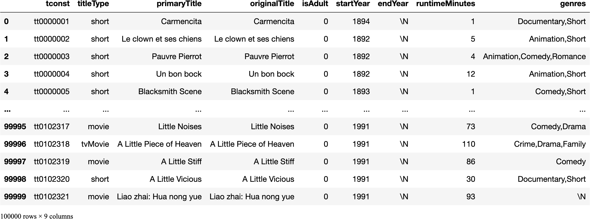
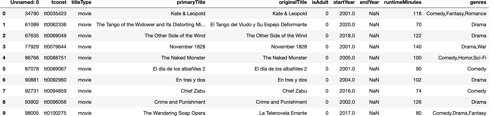
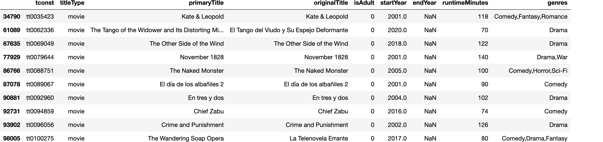
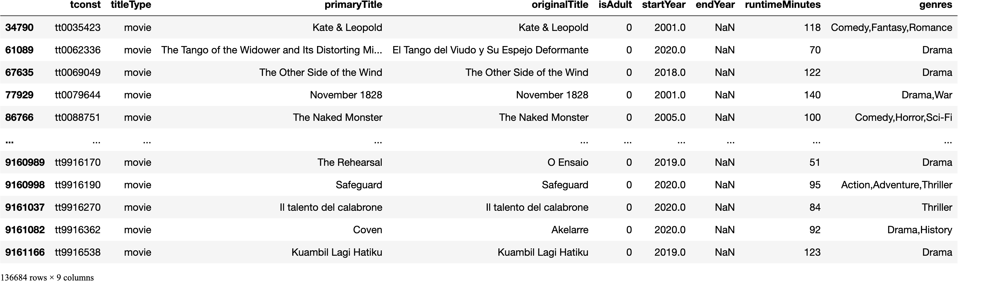
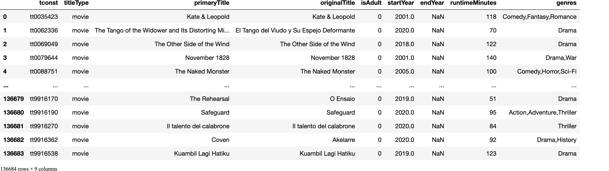

# data-enrichment-loading-large-files-with-low-ram
 
# Processing Large Files with Low RAM

## Problem
- Your machine runs out of RAM (memory) when loading in a large file.


## Solution

Instead of loading the entire dataframe using pd.read_csv, we can instead create a special TextFileReader object, which will allow us to read in our dataframe in chunks. 


1. Use the chunksize argument for `pd.read_csv` to create a TextFileReader.
    - chunksize is the number of rows to load at once. 
    - We will use 100,000 rows in our examples.

```python
df_reader = pd.read_csv(basics_url, sep='\t', low_memory=False, chunksize=100_000 )
df_reader
```
`<pandas.io.parsers.readers.TextFileReader at 0x2ed437f40>`

2. Use the .get_chunk() method to extract the first chunk of rows. 

```python
temp_df = df_reader.get_chunk()
```
3. Figure out your entire workflow for that file using just temp_df chunk, and save to disk.

4. Now combine the workflow into 1 large loop through the entire textfilereader.

5. Use glob to easily combine all chunk csvs into 1 final.


```python
import numpy as np
import pandas as pd
import matplotlib.pyplot as plt
import seaborn as sns
import os
os.makedirs('Data',exist_ok=True)
```


```python
## title basics 
basics_url = 'https://datasets.imdbws.com/title.basics.tsv.gz'
df_reader = pd.read_csv(basics_url, sep='\t',
                        low_memory=False, chunksize=100_000)
df_reader
```


    <pandas.io.parsers.readers.TextFileReader at 0x137946fd0>


- We now get a TextFileReader instead of a DataFrame. 
- The TextFileReader is designed to return one chunk at a time from the source file as a dataframe using the `reader.get_chunk()` method. 
    - It keep tracks of its position in the original file using the  `._currow` attribute. 


```python
## the first row # of the next chunk is stored under ._currow
df_reader._currow
```


    0


- We haven't loaded any chunks yet so currow should indeed be 0.


```python
## get the first df chunk from the reader
temp_df = df_reader.get_chunk()
temp_df
```


    

    


- We should now have an updated currrow that reflects we have already grabbed rows 0 through 99_999.
    - Therefore the currow should be 100_000


```python
## checking the updated ._currow
df_reader._currow
```


    100000


- Now, figure out the filtering steps you need to apply to the temp df.


```python
## Replace "\N" with np.nan
temp_df.replace({'\\N':np.nan},inplace=True)

## Eliminate movies that are null for runtimeMinute, genres, and startYear
temp_df = temp_df.dropna(subset=['runtimeMinutes','genres','startYear'])
```


```python
## keep only titleType==Movie
temp_df = temp_df.loc[ temp_df['titleType']=='movie']
```


```python
## Eliminate movies that include  "Documentary" in genre 
is_documentary = temp_df['genres'].str.contains('documentary',case=False)
temp_df = temp_df[~is_documentary]
temp_df.head()
```


    

    


```python
### Convert startyear to numeric for slicing
temp_df['startYear'] = temp_df['startYear'].astype(float)

## keep startYear 2000-2022
temp_df = temp_df[(temp_df['startYear']>=2000)&(temp_df['startYear']<2022)]
temp_df
```


    

    


- Now, save the filtered dataframe to disk, using the chunk # in the filename.


```python
## Programatically saving an fname using the chunk #
chunk_num=1
fname= f'Data/title_basics_chunk_{chunk_num:03d}.csv.gz'
fname
```


    'Data/title_basics_chunk_001.csv.gz'


- Tip: if we use the ":03d" format code when inserting the chunk number using an f-string, it will add 2 leading 0's, so the first file will be numbered 001 instead of 1. This will be helpful when viewing the files in your file explorer or on GitHub.

- Now, let's save the temp_df to disk, using the filename based on the chunk_num.
    - Make sure to increase the value of chunk_num by 1 after saving the file.
    


```python
## Save temp_df to disk using the fname.
temp_df.to_csv(fname, compression='gzip')

## incrementing chunk_num by 1 for the next file.
chunk_num+=1
```

- While we usually add "index=False" when we save a dataframe to disk, we did not do that above.
- This means that the index will be saved as an additional column, which will show up as "Unnamed: 0" when we load in the csv again.
    - This index will allow us to know which row # each movie was in the original file.
    


```python
pd.read_csv(fname)
```


    

    


- If we add "`index_col=0` to read_csv then it will use this unnamed column as our index, which is the ideal solution.


```python
pd.read_csv(fname, index_col=0)
```


    

    


### Constructing the Loop

- Since the TextFileReader is an iterator, we can loop through the df_reader itself to get the temp_df.

- We will be re-creating the initial temp_df above as part of our final loop.

- We will declare our chunk_num=1 before we start our loop.


```python
# title basics 
basics_url = 'https://datasets.imdbws.com/title.basics.tsv.gz'

chunk_num = 1
df_reader = pd.read_csv(basics_url, sep='\t',
                        low_memory=False, chunksize=100_000)
```


```python
for temp_df in df_reader:
    
    #### COMBINED WORKFLOW FROM ABOVE
    ## Replace "\N" with np.nan
    temp_df.replace({'\\N':np.nan},inplace=True)

    ## Eliminate movies that are null for runtimeMinute, genres, and startYear
    temp_df = temp_df.dropna(subset=['runtimeMinutes','genres','startYear'])
    
    ## keep only titleType==Movie
    temp_df = temp_df.loc[ temp_df['titleType']=='movie']

    ## Eliminate movies that include  "Documentary" in genre 
    is_documentary = temp_df['genres'].str.contains('documentary',case=False)
    temp_df = temp_df[~is_documentary]
    temp_df.head()

    ### Convert startyear to numeric for slicing
    ## convert numeric features
    temp_df['startYear'] = temp_df['startYear'].astype(float)

    ## keep startYear 2000-2022
    temp_df = temp_df[(temp_df['startYear']>=2000)&(temp_df['startYear']<2022)]
    
    
    ### Saving chunk to disk
    fname= f'Data/title_basics_chunk_{chunk_num:03d}.csv.gz'
    temp_df.to_csv(fname, compression='gzip')
    print(f"- Saved {fname}")
    
    chunk_num+=1

df_reader.close()
```

    - Saved Data/title_basics_chunk_001.csv.gz
    - Saved Data/title_basics_chunk_002.csv.gz
    - Saved Data/title_basics_chunk_003.csv.gz
    - Saved Data/title_basics_chunk_004.csv.gz
    - Saved Data/title_basics_chunk_005.csv.gz
    - Saved Data/title_basics_chunk_006.csv.gz
    - Saved Data/title_basics_chunk_007.csv.gz
    - Saved Data/title_basics_chunk_008.csv.gz
    - Saved Data/title_basics_chunk_009.csv.gz
    - Saved Data/title_basics_chunk_010.csv.gz
    - Saved Data/title_basics_chunk_011.csv.gz
    - Saved Data/title_basics_chunk_012.csv.gz
    - Saved Data/title_basics_chunk_013.csv.gz
    - Saved Data/title_basics_chunk_014.csv.gz
    - Saved Data/title_basics_chunk_015.csv.gz
    - Saved Data/title_basics_chunk_016.csv.gz
    - Saved Data/title_basics_chunk_017.csv.gz
    - Saved Data/title_basics_chunk_018.csv.gz
    - Saved Data/title_basics_chunk_019.csv.gz
    - Saved Data/title_basics_chunk_020.csv.gz
    - Saved Data/title_basics_chunk_021.csv.gz
    - Saved Data/title_basics_chunk_022.csv.gz
    - Saved Data/title_basics_chunk_023.csv.gz
    - Saved Data/title_basics_chunk_024.csv.gz
    - Saved Data/title_basics_chunk_025.csv.gz
    - Saved Data/title_basics_chunk_026.csv.gz
    - Saved Data/title_basics_chunk_027.csv.gz
    - Saved Data/title_basics_chunk_028.csv.gz
    - Saved Data/title_basics_chunk_029.csv.gz
    - Saved Data/title_basics_chunk_030.csv.gz
    - Saved Data/title_basics_chunk_031.csv.gz
    - Saved Data/title_basics_chunk_032.csv.gz
    - Saved Data/title_basics_chunk_033.csv.gz
    - Saved Data/title_basics_chunk_034.csv.gz
    - Saved Data/title_basics_chunk_035.csv.gz
    - Saved Data/title_basics_chunk_036.csv.gz
    - Saved Data/title_basics_chunk_037.csv.gz
    - Saved Data/title_basics_chunk_038.csv.gz
    - Saved Data/title_basics_chunk_039.csv.gz
    - Saved Data/title_basics_chunk_040.csv.gz
    - Saved Data/title_basics_chunk_041.csv.gz
    - Saved Data/title_basics_chunk_042.csv.gz
    - Saved Data/title_basics_chunk_043.csv.gz
    - Saved Data/title_basics_chunk_044.csv.gz
    - Saved Data/title_basics_chunk_045.csv.gz
    - Saved Data/title_basics_chunk_046.csv.gz
    - Saved Data/title_basics_chunk_047.csv.gz
    - Saved Data/title_basics_chunk_048.csv.gz
    - Saved Data/title_basics_chunk_049.csv.gz
    - Saved Data/title_basics_chunk_050.csv.gz
    - Saved Data/title_basics_chunk_051.csv.gz
    - Saved Data/title_basics_chunk_052.csv.gz
    - Saved Data/title_basics_chunk_053.csv.gz
    - Saved Data/title_basics_chunk_054.csv.gz
    - Saved Data/title_basics_chunk_055.csv.gz
    - Saved Data/title_basics_chunk_056.csv.gz
    - Saved Data/title_basics_chunk_057.csv.gz
    - Saved Data/title_basics_chunk_058.csv.gz
    - Saved Data/title_basics_chunk_059.csv.gz
    - Saved Data/title_basics_chunk_060.csv.gz
    - Saved Data/title_basics_chunk_061.csv.gz
    - Saved Data/title_basics_chunk_062.csv.gz
    - Saved Data/title_basics_chunk_063.csv.gz
    - Saved Data/title_basics_chunk_064.csv.gz
    - Saved Data/title_basics_chunk_065.csv.gz
    - Saved Data/title_basics_chunk_066.csv.gz
    - Saved Data/title_basics_chunk_067.csv.gz
    - Saved Data/title_basics_chunk_068.csv.gz
    - Saved Data/title_basics_chunk_069.csv.gz
    - Saved Data/title_basics_chunk_070.csv.gz
    - Saved Data/title_basics_chunk_071.csv.gz
    - Saved Data/title_basics_chunk_072.csv.gz
    - Saved Data/title_basics_chunk_073.csv.gz
    - Saved Data/title_basics_chunk_074.csv.gz
    - Saved Data/title_basics_chunk_075.csv.gz
    - Saved Data/title_basics_chunk_076.csv.gz
    - Saved Data/title_basics_chunk_077.csv.gz
    - Saved Data/title_basics_chunk_078.csv.gz
    - Saved Data/title_basics_chunk_079.csv.gz
    - Saved Data/title_basics_chunk_080.csv.gz
    - Saved Data/title_basics_chunk_081.csv.gz
    - Saved Data/title_basics_chunk_082.csv.gz
    - Saved Data/title_basics_chunk_083.csv.gz
    - Saved Data/title_basics_chunk_084.csv.gz
    - Saved Data/title_basics_chunk_085.csv.gz
    - Saved Data/title_basics_chunk_086.csv.gz
    - Saved Data/title_basics_chunk_087.csv.gz
    - Saved Data/title_basics_chunk_088.csv.gz
    - Saved Data/title_basics_chunk_089.csv.gz
    - Saved Data/title_basics_chunk_090.csv.gz
    - Saved Data/title_basics_chunk_091.csv.gz
    - Saved Data/title_basics_chunk_092.csv.gz


- Now that we have saved the individual filtered files, we can combine them back into 1 final file.

### Using `glob` to get list of files that match a pattern 


- Python has a module called glob that has a very helpful function for finding all file paths that match a specific criterion.

- Glob takes a filepath/query and will find every filename that matches the pattern provided.
    - We use asterisks as wildcards in our query.

- In this case, we want to load in the all of the saved title basics chunk files.
    - If we use `"Data/title_basics_chunk*.csv.gz"` as our search query, it will find all files that match the text, where `*` represents any number of other characters.


- We then run `glob.glob(q)` and save the returned list. 


```python
import glob
q = "Data/title_basics_chunk*.csv.gz"
chunked_files = glob.glob(q)

# Showing the first 5 
chunked_files[:5]
```


    ['Data/title_basics_chunk_069.csv.gz',
     'Data/title_basics_chunk_014.csv.gz',
     'Data/title_basics_chunk_077.csv.gz',
     'Data/title_basics_chunk_006.csv.gz',
     'Data/title_basics_chunk_065.csv.gz']


- Note: if we want the list sorted alphabetically, we can use the "sorted" function from python.


```python
import glob
q = "Data/title_basics_chunk*.csv.gz"
chunked_files = sorted(glob.glob(q))

# Showing the first 5 
chunked_files[:5]
```


    ['Data/title_basics_chunk_001.csv.gz',
     'Data/title_basics_chunk_002.csv.gz',
     'Data/title_basics_chunk_003.csv.gz',
     'Data/title_basics_chunk_004.csv.gz',
     'Data/title_basics_chunk_005.csv.gz']


### Combining Many Files

- Now that we have a list of all of the files we want to load in and concatenate, we can use a for loop or list comprehension to do so!


#### For-Loop Way


```python
## Loading all files as df and appending to a list
df_list = []
for file in chunked_files:
    temp_df = pd.read_csv(file, index_col=0)
    df_list.append(temp_df)
    
## Concatenating the list of dfs into 1 combined
df_combined = pd.concat(df_list)
df_combined
```


    

    


#### List Comprehension Way


```python
## Loading and Concatenating the list of dfs with 1 line
df_combined = pd.concat([pd.read_csv(file, index_col=0) for file in chunked_files])
df_combined
```


    

    


- And now we can save this single dataframe as the final combined file we will use going forward.


```python
## Saving the final combined dataframe
final_fname ='Data/title_basics_combined.csv.gz'
df_combined.to_csv(final_fname, compression='gzip', index=False)
```


```python
df_combined = pd.read_csv(final_fname)
df_combined
```


    

    


# APPENDIX

- Bonus functions for getting the size of dataframes and files


```python
import os
def get_memory_usage(df,units='mb'):
    """returns memory size of dataframe in requested units"""
    memory = df.memory_usage().sum()
    
    if units.lower()=='mb':
        denom = 1e6
    elif units.lower()=='gb':
        denom = 1e9
    else:
        raise Exception('Units must be either "mb" or "gb"')
    val = memory/denom
    print(f"- Total Memory Usage = {val} {units.upper()}")
    
```


```python
get_memory_usage(df_combined)
```

    - Total Memory Usage = 9.841376 MB


```python
    
def get_filesize(fname, units='mb'):
    """Get size of file at given path in MB or GB"""
    if units.lower()=='mb':
        denom = 1e6
    elif units.lower()=='gb':
        denom = 1e9
    else:
        raise Exception('Units must be either "mb" or "gb"')
        
    import os
    size = os.path.getsize(fname)
    
    val = size/denom
    print(f"- {fname} is {val} {units.upper()} on disk.")
```


```python
get_filesize(final_fname)
```

    - Data/title_basics_combined.csv.gz is 3.116348 MB on disk.


```python

```
